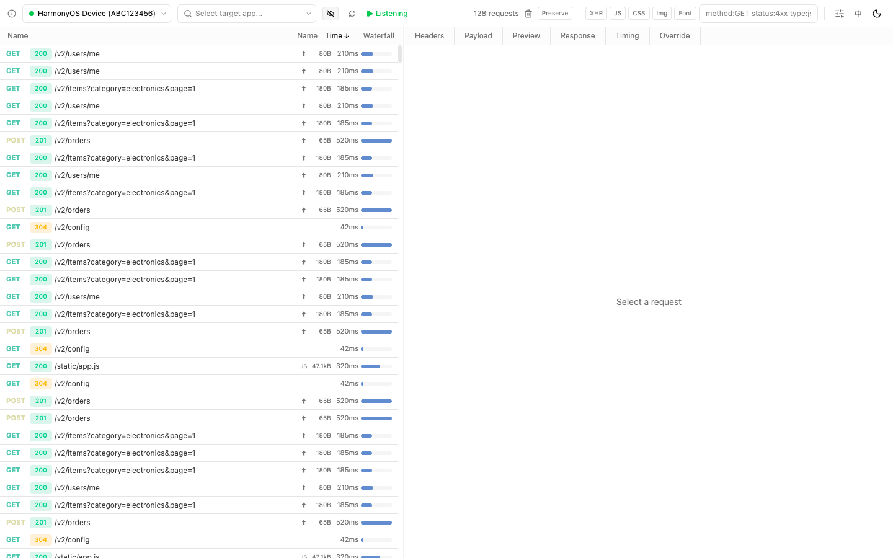
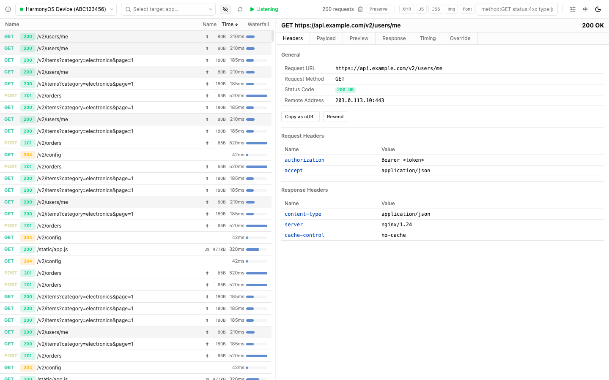
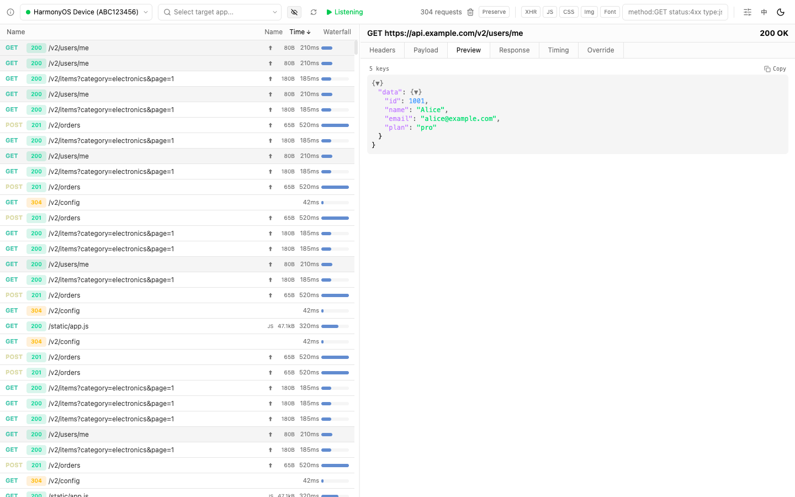
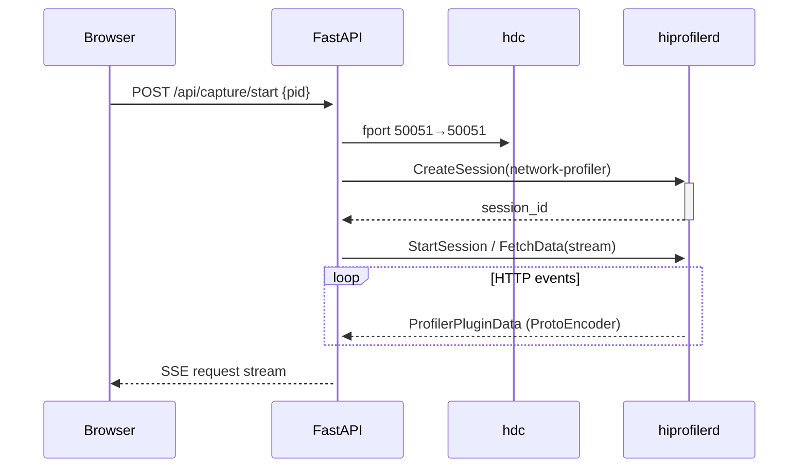

<p align="right"><a href="README.zh.md">中文</a></p>

<h1 align="center">
  <picture>
    <source media="(prefers-color-scheme: dark)" srcset="https://img.shields.io/badge/prism-HarmonyOS_HTTP_Debugger-6366f1?style=for-the-badge">
    
  </picture>
</h1>

<p align="center">
  <strong>Chrome DevTools–style HTTP debugging for HarmonyOS/OpenHarmony devices.</strong><br>
  Zero CA certificate · Process-level hook · Real-time waterfall · Request override
</p>

<p align="center">
  
  
  
</p>

---

## Architecture

prism uses a **dual-backend** architecture. The primary backend communicates directly with the device-side `hiprofilerd` daemon via gRPC — the same mechanism DevEco Studio uses. This hooks into the app process **before TLS**, so no CA certificate is needed. A secondary mitmproxy backend is available when real-time request modification (override) is required.

```
┌──────────────────────────────┐     ┌──────────────────────────────┐
│  gRPC Backend (primary)      │     │  Proxy Backend (fallback)    │
│  hiprofilerd → hdc fport     │     │  mitmproxy → explicit proxy  │
│  No CA cert needed           │     │  Requires CA cert for HTTPS  │
│  Supports: HTTP/HTTPS capture│     │  Supports: capture + override│
└──────────────┬───────────────┘     └──────────────┬───────────────┘
               └──────────┬─────────────────────────┘
                          ▼
               ┌─────────────────────┐
               │    CaptureManager   │
               │    PayloadParser    │
               │    SQLite + SSE     │
               └─────────┬───────────┘
                         ▼
               ┌─────────────────────┐
               │   FastAPI + Web UI  │
               │   localhost:8900    │
               └─────────────────────┘
```

## Features

- **No CA certificate required** — hooks the process at the network layer before TLS, just like DevEco Studio
- **Full HTTP detail** — request/response headers, body, timing breakdown (DNS → TCP → TLS → TTFB → Download)
- **Real-time waterfall** — Chrome DevTools–style request list with timing bars
- **Override engine** — 7 rule types: block, redirect, header modify, response status, response body, response headers, latency simulation
- **HAR export** — standard HTTP Archive format
- **Dual-theme Web UI** — React + Tailwind CSS, dark/light mode with localStorage persistence
- **Process picker** — searchable debuggable-app list with full package names

## Quick Start

### Prerequisites

- Python 3.10+
- [hdc](https://developer.huawei.com/consumer/en/doc/harmonyos-guides-V5/hdc-V5) (HarmonyOS Device Connector) from DevEco Studio
- A HarmonyOS / OpenHarmony device connected via USB or network
- **Proto source files:** Compiled stubs are included. To regenerate them from source, copy the `.proto` files from your DevEco Studio installation:
  ```
  # DevEco Studio profiler plugin JAR (ohos-profiler-*.jar)
  # Extract: jar xf ohos-profiler-*.jar proto/
  ```
  Then place them in `prism/proto/` and rebuild with `protoc`.

### Install

```bash
cd prism-hos-debugger

# Install with binary wheels (no compilation required)
pip install -e ".[dev]" --only-binary=:all:

# If the above fails on your platform, try without --only-binary:
# pip install -e ".[dev]"

cd webui && npm install && npm run build && cd ..
```

### Launch

**Option A: Electron Desktop App (recommended)**

```bash
cd desktop
npm install
npm start
```

A native macOS window opens with the full Web UI embedded. The app runs in the Dock with a tray icon — close the window to minimize to tray, Quit from the tray menu to stop the backend.

To package as a standalone `.app`:

```bash
# First build the Python backend as a standalone binary
cd packaging && ./build.sh

# Copy the binary into the Electron app
cp packaging/dist/prism desktop/resources/prism-backend/

# Build the macOS .app bundle
cd desktop && npm run build
# Output: desktop/dist/Prism-*.dmg
```

**Option B: CLI (browser-based)**

```bash
# List connected devices
prism list-devices

# Start the Web UI (auto-opens browser)
prism start

# Custom ports
prism start --port 8080 --web-port 8900

# Export captured requests as HAR
prism export-har -o session.har
```

Open http://localhost:8900, select a device, pick a target app, and click — HTTP requests appear in real time.

[](screenshots/main-overview.png)

[](screenshots/detail-headers.png)

[](screenshots/detail-preview.png)

> ⚠️ **CRITICAL: App Must Be Profilable**
>
> **The target app's `AppScope/app.json5` MUST include `"profileable": true`** (HarmonyOS API 24+). Without it, the system blocks all performance analysis tools — including the network-profiler — from attaching to the process. Release-signed apps default to `profileable: false`.
>
> ```json5
> // AppScope/app.json5
> {
>   "app": {
>     "profileable": true   // ← REQUIRED
>   }
> }
> ```
>
> If you see the profiler session created but zero HTTP events, this is the most common cause.

> ⚠️ **Request Body Capture Limitation**
>
> The gRPC profiler cannot capture **POST/PUT/PATCH request bodies** when the app uses `@kit.NetworkKit` (the legacy `@ohos.net.http` API). This API does not expose request payloads to the profiler. Only `@kit.RemoteCommunicationKit` (RCP, API 12+) with `TracingConfiguration.outgoingData: true` supports full request body capture.
>
> **What IS captured regardless of HTTP library:** request headers, response headers, response body, timing breakdown (DNS/TCP/TLS/TTFB), and status codes.

> ⚠️ **Boot Order Note**
>
> The profiler hooks into the process at the moment you select it in the Web UI. New HTTP connections opened **after** selection are captured. Pre-existing connections (keepalive sockets, connection pools established before hooking) will not appear.
>
> **For best results:** kill and restart the app before selecting it, so all connections are fresh.

## Capture Modes

### gRPC Mode (default, recommended)

Communicates with the on-device `hiprofilerd` daemon via gRPC over `hdc fport`. The `network-profiler` built-in plugin intercepts HTTP calls inside the target process. **No proxy configuration, no CA certificate.**



### Proxy Mode (with overrides)

Uses mitmproxy as a standard HTTP forward proxy. Supports real-time request/response overrides, but requires CA certificate installation on the device for HTTPS interception.

## Override Rules

| Rule | Description | Example |
|---|---|---|
| `block` | Drop the request | Block all `*.doubleclick.net/*` |
| `url_redirect` | Rewrite the target URL | Redirect `/v1/api` → `/v2/api` |
| `header_modify` | Add/remove request headers | Inject `X-Debug: 1` |
| `response_status` | Change HTTP status code | Return 404 for matched URLs |
| `response_body` | Replace response body | Return mock JSON |
| `response_headers` | Add/remove response headers | Strip `x-powered-by` |
| `latency` | Inject artificial delay | Add 500ms to simulate slow network |

Rules support **glob**, **regex**, **prefix**, and **exact** URL matching with optional HTTP method filtering. Changes take effect immediately — no restart needed.

## API

All endpoints are documented at http://localhost:8900/docs (OpenAPI / Swagger).

| Endpoint | Description |
|---|---|
| `GET /api/devices` | List connected devices |
| `POST /api/devices/select` | Select active device |
| `GET /api/capture/status` | Capture status (backend, running) |
| `GET /api/capture/apps` | List debuggable apps on device |
| `POST /api/capture/start` | Start capture (`{mode:"grpc", pid}`) |
| `POST /api/capture/stop` | Stop active capture |
| `GET /api/requests` | Paginated request log |
| `GET /api/requests/stream` | SSE real-time request feed |
| `GET /api/rules` | List override rules |
| `POST /api/rules` | Create override rule |
| `PATCH /api/rules/{id}/toggle` | Toggle rule on/off |

## Project Structure

```
prism-hos-debugger/
├── prism/                  # Python backend
│   ├── capture/            #   Dual-backend abstraction layer
│   ├── proto/              #   Compiled protobuf stubs (_pb2.py)
│   ├── cli.py              #   CLI entry point
│   ├── device_manager.py   #   hdc wrapper + hiprofilerd lifecycle
│   ├── hiprofiler_client.py#   gRPC client for device daemon
│   ├── payload_parser.py   #   ProtoEncoder → CapturedRequest
│   ├── proxy_core.py       #   mitmproxy integration
│   ├── override_engine.py  #   Request override rule engine
│   ├── webui_server.py     #   FastAPI REST + SSE
│   ├── models.py           #   Pydantic data models
│   └── db.py               #   SQLite persistence
├── webui/                  # React frontend
│   ├── src/components/     #   UI components
│   ├── src/lib/            #   API client + utilities
│   └── dist/               #   Production build
├── tests/                  # Python tests (33/33)
├── pyproject.toml
└── README.md
```

## License

MIT

