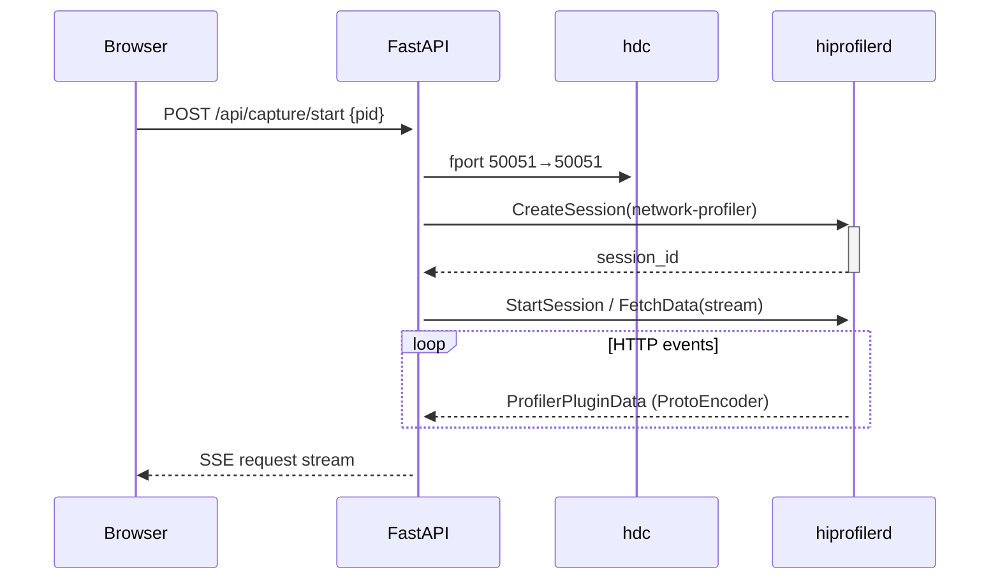

<p align="center">
  <a href="#readme-en">English</a> · <a href="#readme-zh">中文</a>
</p>

---

<h1 id="readme-en" align="center">
  <picture>
    <source media="(prefers-color-scheme: dark)" srcset="https://img.shields.io/badge/prism-HarmonyOS_HTTP_Debugger-6366f1?style=for-the-badge">
    
  </picture>
</h1>

<p align="center">
  <strong>Chrome DevTools–style HTTP debugging for HarmonyOS/OpenHarmony devices.</strong><br>
  Zero CA certificate · Process-level hook · Real-time waterfall · Request override
</p>

<p align="center">
  
  
  
</p>

---

## Architecture

prism uses a **dual-backend** architecture. The primary backend communicates directly with the device-side `hiprofilerd` daemon via gRPC — the same mechanism DevEco Studio uses. This hooks into the app process **before TLS**, so no CA certificate is needed. A secondary mitmproxy backend is available when real-time request modification (override) is required.

```
┌──────────────────────────────┐     ┌──────────────────────────────┐
│  gRPC Backend (primary)      │     │  Proxy Backend (fallback)    │
│  hiprofilerd → hdc fport     │     │  mitmproxy → explicit proxy  │
│  No CA cert needed           │     │  Requires CA cert for HTTPS  │
│  Supports: HTTP/HTTPS capture│     │  Supports: capture + override│
└──────────────┬───────────────┘     └──────────────┬───────────────┘
               └──────────┬─────────────────────────┘
                          ▼
               ┌─────────────────────┐
               │    CaptureManager   │
               │    PayloadParser    │
               │    SQLite + SSE     │
               └─────────┬───────────┘
                         ▼
               ┌─────────────────────┐
               │   FastAPI + Web UI  │
               │   localhost:8900    │
               └─────────────────────┘
```

## Features

- **No CA certificate required** — hooks the process at the network layer before TLS, just like DevEco Studio
- **Full HTTP detail** — request/response headers, body, timing breakdown (DNS → TCP → TLS → TTFB → Download)
- **Real-time waterfall** — Chrome DevTools–style request list with timing bars
- **Override engine** — 7 rule types: block, redirect, header modify, response status, response body, response headers, latency simulation
- **HAR export** — standard HTTP Archive format
- **Dual-theme Web UI** — React + Tailwind CSS, dark/light mode with localStorage persistence
- **Process picker** — searchable debuggable-app list with full package names

## Quick Start

### Prerequisites

- Python 3.10+
- [hdc](https://developer.huawei.com/consumer/en/doc/harmonyos-guides-V5/hdc-V5) (HarmonyOS Device Connector) from DevEco Studio
- A HarmonyOS / OpenHarmony device connected via USB or network

### Install

```bash
cd prism-hos-debugger
pip install -e ".[dev]"
cd webui && npm install && npm run build && cd ..
```

### Launch

```bash
# List connected devices
prism list-devices

# Start the Web UI (auto-opens browser)
prism start

# Custom ports
prism start --port 8080 --web-port 8900

# Export captured requests as HAR
prism export-har -o session.har
```

Open http://localhost:8900, select a device, pick a target app, and click — HTTP requests appear in real time.

> ⚠️ **CRITICAL: App Must Be Profilable**
>
> **The target app's `AppScope/app.json5` MUST include `"profileable": true`** (HarmonyOS API 24+). Without it, the system blocks all performance analysis tools — including the network-profiler — from attaching to the process. Release-signed apps default to `profileable: false`.
>
> ```json5
> // AppScope/app.json5
> {
>   "app": {
>     "profileable": true   // ← REQUIRED
>   }
> }
> ```
>
> If you see the profiler session created but zero HTTP events, this is the most common cause.

> ⚠️ **Request Body Capture Limitation**
>
> The gRPC profiler cannot capture **POST/PUT/PATCH request bodies** when the app uses `@kit.NetworkKit` (the legacy `@ohos.net.http` API). This API does not expose request payloads to the profiler. Only `@kit.RemoteCommunicationKit` (RCP, API 12+) with `TracingConfiguration.outgoingData: true` supports full request body capture.
>
> **What IS captured regardless of HTTP library:** request headers, response headers, response body, timing breakdown (DNS/TCP/TLS/TTFB), and status codes.

> ⚠️ **Boot Order Note**
>
> The profiler hooks into the process at the moment you select it in the Web UI. New HTTP connections opened **after** selection are captured. Pre-existing connections (keepalive sockets, connection pools established before hooking) will not appear.
>
> **For best results:** kill and restart the app before selecting it, so all connections are fresh.

## Capture Modes

### gRPC Mode (default, recommended)

Communicates with the on-device `hiprofilerd` daemon via gRPC over `hdc fport`. The `network-profiler` built-in plugin intercepts HTTP calls inside the target process. **No proxy configuration, no CA certificate.**



### Proxy Mode (with overrides)

Uses mitmproxy as a standard HTTP forward proxy. Supports real-time request/response overrides, but requires CA certificate installation on the device for HTTPS interception.

## Override Rules

| Rule | Description | Example |
|---|---|---|
| `block` | Drop the request | Block all `*.doubleclick.net/*` |
| `url_redirect` | Rewrite the target URL | Redirect `/v1/api` → `/v2/api` |
| `header_modify` | Add/remove request headers | Inject `X-Debug: 1` |
| `response_status` | Change HTTP status code | Return 404 for matched URLs |
| `response_body` | Replace response body | Return mock JSON |
| `response_headers` | Add/remove response headers | Strip `x-powered-by` |
| `latency` | Inject artificial delay | Add 500ms to simulate slow network |

Rules support **glob**, **regex**, **prefix**, and **exact** URL matching with optional HTTP method filtering. Changes take effect immediately — no restart needed.

## API

All endpoints are documented at http://localhost:8900/docs (OpenAPI / Swagger).

| Endpoint | Description |
|---|---|
| `GET /api/devices` | List connected devices |
| `POST /api/devices/select` | Select active device |
| `GET /api/capture/status` | Capture status (backend, running) |
| `GET /api/capture/apps` | List debuggable apps on device |
| `POST /api/capture/start` | Start capture (`{mode:"grpc", pid}`) |
| `POST /api/capture/stop` | Stop active capture |
| `GET /api/requests` | Paginated request log |
| `GET /api/requests/stream` | SSE real-time request feed |
| `GET /api/rules` | List override rules |
| `POST /api/rules` | Create override rule |
| `PATCH /api/rules/{id}/toggle` | Toggle rule on/off |

## Project Structure

```
prism-hos-debugger/
├── prism/                  # Python backend
│   ├── capture/            #   Dual-backend abstraction layer
│   ├── proto/              #   Protobuf definitions (Apache 2.0, from DevEco Studio)
│   ├── cli.py              #   CLI entry point
│   ├── device_manager.py   #   hdc wrapper + hiprofilerd lifecycle
│   ├── hiprofiler_client.py#   gRPC client for device daemon
│   ├── payload_parser.py   #   ProtoEncoder → CapturedRequest
│   ├── proxy_core.py       #   mitmproxy integration
│   ├── override_engine.py  #   Request override rule engine
│   ├── webui_server.py     #   FastAPI REST + SSE
│   ├── models.py           #   Pydantic data models
│   └── db.py               #   SQLite persistence
├── webui/                  # React frontend
│   ├── src/components/     #   UI components
│   ├── src/lib/            #   API client + utilities
│   └── dist/               #   Production build
├── tests/                  # Python tests (33/33)
├── docs/                   # Technical documentation
├── pyproject.toml
└── README.md
```

## Documentation

- [Technical Notes](docs/dev-notes.md) — Reverse-engineering methodology, hdc commands, platform constraints, protobuf protocol
- [Proto Reference](docs/proto-reference.md) — gRPC service definitions, session lifecycle, ClockId enum

## License

MIT

---

<p align="center">
  <a href="#readme-en">↑ Back to English</a> · <a href="#readme-zh">↓ 中文</a>
</p>

---

<h1 id="readme-zh" align="center">
  <picture>
    
  </picture>
</h1>

<p align="center">
  <strong>Chrome DevTools 风格 · HarmonyOS/OpenHarmony 设备 HTTP 调试工具</strong><br>
  无需 CA 证书 · 进程级注入 · 实时瀑布流 · 请求覆写
</p>

## 工作原理

prism 采用**双后端**架构。主后端通过 gRPC 与设备端 `hiprofilerd` 守护进程通信——与 DevEco Studio 使用相同的机制——在 **TLS 加密之前**截获应用进程的 HTTP 请求，因此不需要安装 CA 证书。辅助后端 mitmproxy 用于需要实时修改请求/响应的场景。

## 功能

- **无需 CA 证书** — 进程级 hook，在 TLS 之前读取明文，与 DevEco Studio 原理一致
- **完整 HTTP 详情** — 请求头/响应头/请求体/响应体，DNS/TCP/TLS/TTFB 时序分解
- **实时瀑布流** — Chrome DevTools 风格请求列表 + 时序条
- **覆写引擎** — 7 种规则：拦截、重定向、修改请求头、修改响应状态码、替换响应体、修改响应头、延迟模拟
- **HAR 导出** — 标准 HTTP Archive 格式
- **双主题 Web UI** — React + Tailwind CSS，深色/浅色模式，localStorage 持久化
- **应用选择器** — 可搜索的可调试进程列表，显示完整包名和简短名称

## 快速开始

### 环境要求

- Python 3.10+
- [hdc](https://developer.huawei.com/consumer/cn/doc/harmonyos-guides-V5/hdc-V5)（DevEco Studio 自带）
- HarmonyOS / OpenHarmony 设备，通过 USB 或网络连接

### 安装

```bash
cd prism-hos-debugger
pip install -e ".[dev]"
cd webui && npm install && npm run build && cd ..
```

### 启动

```bash
prism list-devices          # 列出已连接设备
prism start                 # 启动 Web UI（自动打开浏览器）
prism start --web-port 8900 # 指定端口
prism export-har -o session.har  # 导出 HAR 文件
```

打开 http://localhost:8900，选择设备 → 选择目标应用 → 点击开始，HTTP 请求实时显示。

> ⚠️ **关键：App 必须可分析（Profilable）**
>
> **目标 app 的 `AppScope/app.json5` 必须配置 `"profileable": true`**（HarmonyOS API 24+）。没有这个配置，系统安全策略会阻止所有性能分析工具（包括 network-profiler）接入进程。Release 签名 app 默认为 `false`。
>
> ```json5
> // AppScope/app.json5
> {
>   "app": {
>     "profileable": true   // ← 必须配置
>   }
> }
> ```
>
> 如果看到 profiler session 创建成功但零 HTTP 事件，这通常就是原因。

> ⚠️ **请求体捕获限制**
>
> gRPC 模式的 profiler **无法捕获 POST/PUT/PATCH 请求体**（当 app 使用 `@kit.NetworkKit` 即旧版 `@ohos.net.http` API 时）。该 API 不向 profiler 暴露请求负载数据。只有使用 `@kit.RemoteCommunicationKit`（RCP，API 12+）并配置 `TracingConfiguration.outgoingData: true` 的应用才能支持完整请求体捕获。
>
> **无论使用何种 HTTP 库，以下数据均可捕获：** 请求头、响应头、响应体、耗时分析（DNS/TCP/TLS/TTFB）、状态码。

> ⚠️ **启动顺序说明**
>
> Profiler 在 Web UI 中选中应用的那一刻 hook 进程。选中**之后**新建的 HTTP 连接会被捕获。已有连接（keepalive、连接池）不会出现。
>
> **最佳实践：** 选中前先杀掉并重启应用，确保所有连接都是新的。

## 采集模式

### gRPC 模式（默认推荐）

通过 `hdc fport` 端口转发，与设备端 `hiprofilerd` 守护进程建立 gRPC 连接。`network-profiler` 内置插件在目标进程内拦截 HTTP 调用。**无需配置代理，无需安装证书。**

### 代理模式（支持覆写）

使用 mitmproxy 作为标准 HTTP 正向代理。支持实时请求/响应覆写，但 HTTPS 需要设备端安装 CA 证书。

## 覆写规则

| 规则 | 作用 | 示例 |
|---|---|---|
| `block` | 拦截请求 | 拦截所有 `*.doubleclick.net/*` |
| `url_redirect` | 重写目标 URL | 将 `/v1/api` 重定向到 `/v2/api` |
| `header_modify` | 添加/移除请求头 | 注入 `X-Debug: 1` |
| `response_status` | 修改 HTTP 状态码 | 对匹配 URL 返回 404 |
| `response_body` | 替换响应体 | 返回 mock JSON |
| `response_headers` | 添加/移除响应头 | 移除 `x-powered-by` |
| `latency` | 注入延迟 | 添加 500ms 模拟慢速网络 |

支持 glob、正则、前缀、精确四种匹配模式，可选 HTTP 方法过滤。规则变更即时生效。

## 项目结构

```
prism-hos-debugger/
├── prism/                  # Python 后端
│   ├── capture/            #   双后端抽象层
│   ├── proto/              #   Protobuf 定义（源自 DevEco Studio，Apache 2.0 协议）
│   ├── cli.py              #   命令行入口
│   ├── device_manager.py   #   hdc 封装 + hiprofilerd 生命周期管理
│   ├── hiprofiler_client.py#   设备守护进程 gRPC 客户端
│   ├── payload_parser.py   #   ProtoEncoder 二进制 → CapturedRequest
│   ├── proxy_core.py       #   mitmproxy 集成
│   ├── override_engine.py  #   请求覆写规则引擎
│   ├── webui_server.py     #   FastAPI REST + SSE
│   ├── models.py           #   Pydantic 数据模型
│   └── db.py               #   SQLite 持久化
├── webui/                  # React 前端
│   ├── src/components/     #   UI 组件
│   ├── src/lib/            #   API 客户端 + 工具函数
│   └── dist/               #   生产构建
├── tests/                  # Python 测试（33/33）
├── docs/                   # 技术文档
├── pyproject.toml
└── README.md
```

## API

所有端点文档见 http://localhost:8900/docs（OpenAPI / Swagger）。

| 端点 | 说明 |
|---|---|
| `GET /api/devices` | 列出已连接设备 |
| `POST /api/devices/select` | 选择活动设备 |
| `GET /api/capture/status` | 采集状态（后端类型、运行状态） |
| `GET /api/capture/apps` | 列出设备上可调试应用 |
| `POST /api/capture/start` | 开始采集（`{mode:"grpc", pid}`） |
| `POST /api/capture/stop` | 停止采集 |
| `GET /api/requests` | 请求日志（分页） |
| `GET /api/requests/stream` | SSE 实时请求推送 |
| `GET /api/rules` | 列出覆写规则 |
| `POST /api/rules` | 创建覆写规则 |
| `PATCH /api/rules/{id}/toggle` | 启用/禁用规则 |

## 技术文档

- [技术笔记](docs/dev-notes.md) — 逆向分析方法、hdc 命令、平台限制、protobuf 协议
- [Proto 参考](docs/proto-reference.md) — gRPC 服务定义、Session 生命周期、ClockId 枚举

## 协议

MIT

---

<p align="center">
  <a href="#readme-en">↑ English</a> · <a href="#readme-zh">↑ Back to 中文</a>
</p>
